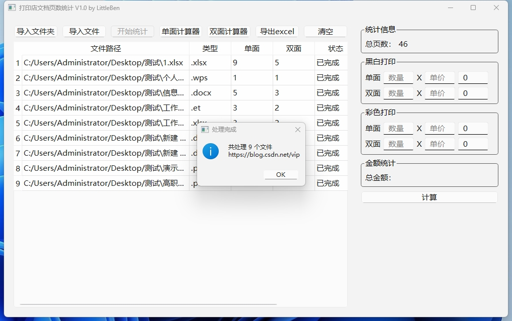

# 文档页数统计工具 (Document Page Counter)

一个基于PyQt6的文档页数统计和打印费用计算工具。支持PDF、Word、Excel、PPT等多种文档格式的页数统计,可用于快速计算打印费用。


## 🌟 功能特点

- 多种文件格式支持
- 批量导入和统计
- 拖拽文件/文件夹
- 黑白/彩色打印费用计算
- 单双面打印页数自动统计
- 简洁直观的用户界面

## 📄 支持的文件类型

### Microsoft Office 格式
- Word文档: `.doc`, `.docx`
- Excel表格: `.xls`, `.xlsx` 
- PowerPoint演示: `.ppt`, `.pptx`

### WPS Office 格式
- 文字: `.wps`
- 表格: `.et`
- 演示: `.dps`

### 其他格式
- PDF文档: `.pdf`

## 🔧 安装要求

### 系统要求
- Python 3.6+
- Windows操作系统
- Microsoft Office (用于处理Office文档)

### 依赖库
```bash
pip install -r requirements.txt
```

或手动安装:
```bash
pip install PyQt6
pip install python-docx
pip install PyPDF2
pip install python-pptx
pip install PyMuPDF
pip install pywin32
```

## 🚀 快速开始

1. 克隆仓库
```bash
git clone https://github.com/hnauto/PageAID.git
cd doc-page-counter
```

2. 安装依赖
```bash
pip install -r requirements.txt
```

3. 运行程序
```bash
python count.py
```

## 📖 使用说明

### 导入文件
- 点击"导入文件"选择单个或多个文件
- 点击"导入文件夹"选择整个文件夹
- 直接拖拽文件/文件夹到程序窗口

### 统计页数
1. 导入文件后点击"开始统计"
2. 等待统计完成
3. 查看表格中显示的单双面页数

### 费用计算
1. 在右侧面板设置打印参数:
   - 黑白/彩色单价
   - 单面/双面数量
2. 点击"计算"显示总金额

## ⚠️ 注意事项

### 文件格式说明

#### PDF文档 (.pdf)
- 使用PyMuPDF库直接读取页数
- 支持加密PDF
- 统计速度最快

#### Word文档 (.doc/.docx/.wps)
- Windows系统需安装Microsoft Word
- 通过COM接口调用Word程序统计
- 支持复杂排版文档

#### Excel表格 (.xls/.xlsx/.et) 
- Windows系统需安装Microsoft Excel
- 通过转换为PDF后统计页数
- 会统计所有工作表的打印页数

#### PowerPoint (.ppt/.pptx/.dps)
- 直接读取幻灯片数量
- 一张幻灯片计为一页
- 不考虑打印设置中的每页幻灯片数

### 常见问题
- Office文件被占用时无法统计
- 建议关闭已打开的文档再统计
- WPS格式文件需要安装WPS Office

## 🤝 贡献

欢迎提交问题和改进建议! 提交PR前请确保:

1. 更新测试用例
2. 更新文档说明
3. 遵循现有代码风格

## 📝 许可证

[MIT License](LICENSE)

## 📧 联系方式

如有问题或建议,请提交 [Issue](https://github.com/hnauto/PageAID/issues)
